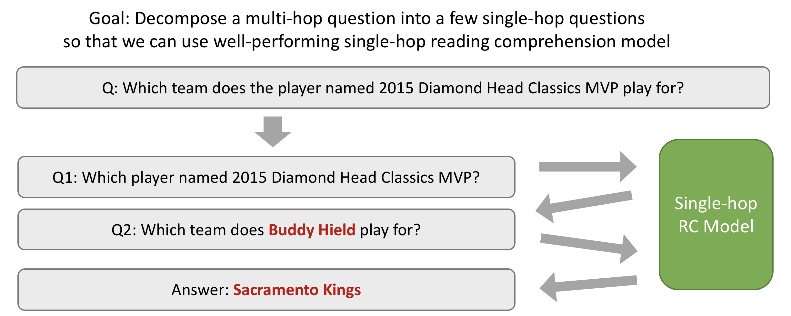
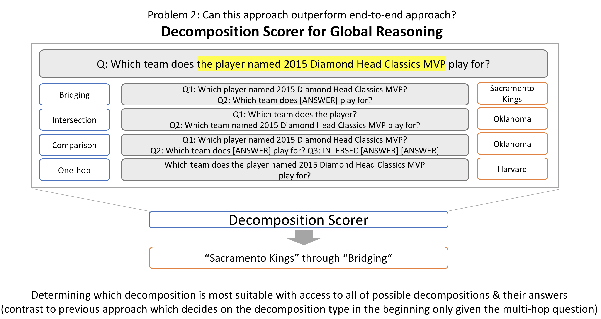

# DecompRC: Multi-hop Reading Comprehension by Decomposition

Here, we describe how to train DecompRC.

## Model Description

Our model, *DecompRC*, answers to the multi-hop question by decomposition. It decomposes the question into a set of sub-questions according to the reasoning type (bridging, intersection, comparison and single-hop), answers each sub-question through single-hop reading comprehension model, and uses a decomposition scorer to output the most suitable decomposition & final answer.





*DecompRC* was submitted to the [HotpotQA leaderboard](https://hotpotqa.github.io) in Feb, 2019 and is still the best performing model out of models submitted to both distractor setting and full wiki setting (as of Jun, 2019).

## Instruction

*Note*: We highly recommend to download the pretrained model first and run the code for inference before training the model, follwoing `README` in the parent directory, to make sure all codes run properly.

*Note*: The code for comparison questions is under construction. We release the pretrained models and intermediate outputs for the comparison questions, so please use them for now.


### Preprocessing

1. Download HotpotQA data and Pretrained BERT

You can download original HotpotQA data (`train`, `dev-distractor`) from [HotpotQA website](https://hotpotqa.github.io).

You can download pretrained Tensorflow BERT from [Google's original BERT repo](https://github.com/google-research/bert). This code is tested on BERT-Base, Uncased. You can convert tf checkpoint into pytorch via `convert_tf_checkpoint_to_pytorch.py`.

2. Convert HotpotQA into SQuAD style

The following command converts HotpotQA into SQuAD style, and store files into `data/hotpot-all` directory.
```
python convert_hotpot2squad.py --data_dir {DATA_DIR} --task hotpot-all
```

`{DATA_DIR}` indicates the directory with `hotpot` data files. (e.g. the directory  should contain `hotpot_train_v1.json` and `hotpot_dev_distractor_v1.json`)

### Training & Inference

If you place downloaded `DecompRC-all-models-and-data.zip`, unzip it & place `data` and `model` inside `DecompRC`, and place pytorch model of uncased BERT-Base inside `model/uncased_L-12_H-768_A-12`, you can simply do `make inference` to run all codes for the inference in the first available gpu (`CUDA_VISIBLE_DEVICES=0`).


The following is the step-by-step instruction of each procedure.

1. Decomposition Model

The following commands are for training.

```
  # Bridging
  python3 main.py --do_train --model span-predictor \
        --output_dir out/decom-bridge \
        --train_file data/decomposition-data/decomposition-bridge-train-v1.json \
        --predict_file data/decomposition-data/decomposition-bridge-dev-v1.json \
        --max_seq_length 100 --train_batch_size 50 --predict_batch_size 100 \
        --max_n_answers 1 --eval_period 50 --num_train_epochs 5000 --wait_step 50 \
        --with_key
  # Intersection
  python3 main.py --do_train --model span-predictor \
        --output_dir out/decom-intersec \
        --predict_file /home/sewon/data/hotpot_decomposed/annotated-span-intersec-dev-v1.1.json \
        --train_file /home/sewon/data/hotpot_decomposed/annotated-span-intersec-train-v1.1.json \
        --max_seq_length 100 --train_batch_size 50 --predict_batch_size 100 \
        --max_n_answers 1 --eval_period 50 --num_train_epochs 5000 --wait_step 50
```

During training, it will print Exact Match Accuracy of decomposition on the dev set. It does not matter too much because there are often multiple possible decompositions. For reference, the model near the convergence achieves 76-82% (bridging) and 68-78% (intersection).

Useful commands:
- `--train_batch_size` and `--predict_batch_size` based on memory availability.
- `--init_checkpoint`, `--bert_config_file` and `vocab_file` based on the path to the pretrained BERT. By default, it assums all files are in `model/uncased_L-12_H-768_A-12`.
- `--output_dir`: a directory to save model.
- `--eval_period`: a frequency to evaluate the model on the dev set.


The following commands are for inference.
```
  # Bridging
  python3 main.py --do_predict --model span-predictor \
              --output_dir out/decom-bridge \
              --init_checkpoint out/decom-bridge/best-model.pt \
              --predict_file data/hotpot-all/dev.json,data/decomposition-data/decomposition-bridge-dev-v1.json \
              --max_seq_length 100 --max_n_answers 1 --prefix dev_ --with_key
  # Intersection
  python3 main.py --do_predict --model span-predictor \
              --output_dir out/decom-intersec \
              --init_checkpoint out/decom-intersec/best-model.pt \
              --predict_file data/hotpot-all/dev.json,data/decomposition-data/decomposition-intersec-dev-v1.json \
              --max_seq_length 100 --max_n_answers 1 --prefix dev_
```


2. Single-hop RC Model

This single-hop RC part can be done with any RC model. In this work, we use the single-hop RC model same as [this model](https://github.com/shmsw25/single-hop-rc/).

To train a model,
```
python main.py --do_train --output_dir out/hotpot --train_file data/hotpot-all/train.json --predict_file data/hotpot-all/dev.json
```

To make an inference,

```
python main.py --do_predict --output_dir out/hotpot --predict_file data/hotpot-all/dev.json --init_checkpoint out/hotpot/best-model.pt --predict_batch_size 32 --max_seq_length 300 --prefix dev_
```

Data for training and inference can be any reading comprehension data in multi-paragraph SQuAD format (as the output of `convert_hotpot2squad.py`).

The above commands trains the model on HotpotQA, but we want to train a single-hop RC model that is trained on single-hop reading comprehension dataset. To this end, as described in the paper, we augment SQuAD data by retrieving paragraphs from Wikipedia using TF-IDF similarity with the question, following the code from [DrQA](https://github.com/facebookresearch/DrQA). We obtain three versions of augmented SQuAD with n=0,2,4 paragraphs from Wikipedia in addition to the original paragraph. Then, we obtain three models, trained on each of them. We store three model inside `out/onehop`, as `model1.pt`, `model2.pt` and `model3.pt`.


After obtaining all of models, you can make an inference for the sub-questions as follows.

```
  # For bridging
  python3 run_decomposition.py --task decompose --data_type dev_b --out_name out/decom-bridge
  python3 main.py --do_predict --output_dir out/onehop \
    --predict_file data/decomposed/dev_b.1.json \
    --init_checkpoint out/onehop/model1.pt,out/onehop/model2.pt,out/onehop/model3.pt \
    --prefix dev_b_1_ --n_best_size 4
  python3 run_decomposition.py --task plug --data_type dev_b --topk 10
  python3 qa/my_main.py --do_predict --output_dir out/onehop \
    --predict_file data/decomposed/dev_b.2.json \
    --init_checkpoint out/onehop/model1.pt,out/onehop/model2.pt,out/onehop/model3.pt \
    --prefix dev_b_2_ --n_best_size 4
  python3 run_decomposition.py --task aggregate-bridge --data_type dev_b --topk 10

  # For intersection
  python3 run_decomposition.py --task decompose --data_type dev_i --out_name out/decom-intersec
  python3 main.py --do_predict --output_dir out/onehop
    --predict_file data/decomposed/dev_i.1.json \
    --init_checkpoint out/onehop/model1.pt,out/onehop/model2.pt,out/onehop/model3.pt \
    --prefix dev_i_1_ --n_best_size 4
  python3 qa/my_main.py --do_predict --output_dir out/onehop \
    --predict_file data/decomposed/dev_i.2.json \
    --init_checkpoint out/onehop/model1.pt,out/onehop/model2.pt,out/onehop/model3.pt \
    --prefix dev_i_2_ --n_best_size 4
  python3 run_decomposition.py --task aggregate-intersec --data_type dev_i --topk 10

  # For original
  python3 main.py --do_predict --output_dir out/hotpot \
    --predict_file data/hotpot-all/dev.json \
    --init_checkpoint out/hotpot/best-model.pt --prefix dev_ --n_best_size 4
  python3 run_decomposition.py --task onehop --data_type dev --topk 10
```

If everything runs properly, you will obtain three files in `data/decomposed-prediction`, `{RTYPE}_decomposed_dev_nbest_predictions.json`, where `{RTYPE}` is `bridge`, `intersec` and `onehop`.

The above commands make an inference on the dev data. To train a decomposition scorer in the next step, the same procedure has to be made on the train data, by replacing every `dev` to `train`. Note that it can take much time & memory. Therefore, we highly recommend to make an inference using the pretrained decomposition scorer on the dev set and make sure you can get good F1 score (around 70 F1; following the instruction below) before making an inference on the train set here. Or, train a decomposition scorer using the released prediction files on the train set and make sure you can get good F1 score.


*Note*: Code for comparison questions is under construction. For now, please use the released intermediate outputs.

3. Decomposition Scorer

To train a decomposition scorer,
```
  python3 main.py --do_train --output_dir out/scorer --model classifier \
    --predict_file data/hotpot-all/dev.json,comparison,bridge,intersec,onehop \
    --train_file data/hotpot-all/train.json,bridge,intersec,onehop \
    --train_batch_size 60 --predict_batch_size 900 --max_seq_length 400 --eval_period 2000
```

The F1 score printed during the training is the final F1 score of DecompRC on the dev set of HotpotQA.

To make an inference,

```
  python3 my_main.py --do_predict --output_dir out/scorer --model classifier \
    --predict_file data/hotpot-all/dev.json,comparison,bridge,intersec,onehop \
    --init_checkpoint out/scorer/best-model.pt --max_seq_length 400 --prefix dev_
```

It stores the score for each reasoning type in `out/scorer/class_scores.json`. The answer to each question is the answer from the reasoning type with maximum score.

To display the breakdown of F1 score using `prettytable` and save the final prediction file that is comparable to the submission for official HotpotQA evaluation, please run `python3 show_result.py --data_file {ORIGINAL_HOTPOT_DEV_FILE} --prediction_file {FILE_TO_SAVE}`.

## Contact

For any question, please contact [Sewon Min](https://shmsw25.github.io).

